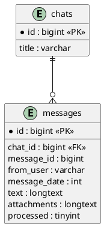

# Entity Relationship Diagram

```plantuml
@startuml
entity chats {
  *id : bigint <<PK>>
  --
  title : varchar
}

entity messages {
  *id : bigint <<PK>>
  --
  chat_id : bigint <<FK>>
  message_id : bigint
  from_user : varchar
  message_date : int
  text : longtext
  attachments : longtext
  processed : tinyint
}

chats ||--o{ messages : ""
@enduml
```
